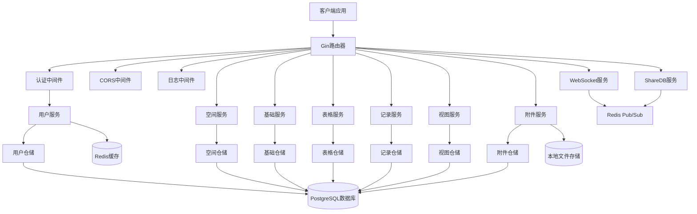

# 设计文档

## 概述

本设计文档描述了一个类似Airtable的后端系统架构，使用Golang + PostgreSQL技术栈实现。系统采用微服务架构，支持动态schema管理、多租户、实时协作和高性能查询。

核心设计原则：
- 模块化和可扩展性
- 高性能和低延迟
- 数据一致性和完整性
- 安全性和权限控制
- 易于维护和部署

## 架构

### 整体架构



### 技术栈

- **Web框架**: Gin (高性能HTTP路由)
- **数据库**: PostgreSQL (支持JSONB字段和动态查询)
- **ORM**: GORM (对象关系映射)
- **缓存**: Redis (查询缓存和会话管理)
- **实时通信**: WebSocket + Redis Pub/Sub (实时协作)
- **文件存储**: 本地存储/MinIO/S3 (附件存储)
- **认证**: JWT + RBAC (基于角色的访问控制)
- **日志**: Zap (结构化日志)
- **配置管理**: Viper (配置文件和环境变量)

### 架构模式

系统采用**领域驱动设计(DDD)**和**清洁架构**原则：

- **领域层(Domain)**: 包含业务实体、值对象和领域服务
- **应用层(Application)**: 包含应用服务和用例编排
- **基础设施层(Infrastructure)**: 包含数据库、缓存、文件存储等外部依赖
- **接口层(Interfaces)**: 包含HTTP处理器、中间件和WebSocket处理器

### 项目结构

```
teable-go-backend/
├── cmd/
│   └── server/
│       └── main.go                 # 应用入口
├── internal/
│   ├── application/                # 应用层
│   │   ├── user_service.go
│   │   └── ...
│   ├── domain/                     # 领域层
│   │   ├── user/
│   │   │   ├── entity.go
│   │   │   ├── repository.go
│   │   │   └── service.go
│   │   ├── table/
│   │   ├── record/
│   │   └── ...
│   ├── infrastructure/             # 基础设施层
│   │   ├── database/
│   │   ├── cache/
│   │   ├── storage/
│   │   └── repository/
│   └── interfaces/                 # 接口层
│       ├── http/
│       └── middleware/
├── pkg/                           # 公共包
│   ├── logger/
│   ├── errors/
│   └── utils/
└── config/                        # 配置文件
    └── config.yaml
```

## 组件和接口

### 1. 核心数据模型

#### 用户模型
```go
type User struct {
    ID                   string     `json:"id"`
    Name                 string     `json:"name"`
    Email                string     `json:"email"`
    Password             *string    `json:"-"`
    Phone                *string    `json:"phone"`
    Avatar               *string    `json:"avatar"`
    IsSystem             bool       `json:"is_system"`
    IsAdmin              bool       `json:"is_admin"`
    IsTrialUsed          bool       `json:"is_trial_used"`
    LastSignTime         *time.Time `json:"last_sign_time"`
    DeactivatedTime      *time.Time `json:"deactivated_time"`
    CreatedTime          time.Time  `json:"created_time"`
    DeletedTime          *time.Time `json:"deleted_time"`
    LastModifiedTime     *time.Time `json:"last_modified_time"`
}
```

#### 空间模型
```go
type Space struct {
    ID               string     `json:"id"`
    Name             string     `json:"name"`
    Description      *string    `json:"description"`
    Icon             *string    `json:"icon"`
    IsSystem         bool       `json:"is_system"`
    CreatedBy        string     `json:"created_by"`
    CreatedTime      time.Time  `json:"created_time"`
    DeletedTime      *time.Time `json:"deleted_time"`
    LastModifiedTime *time.Time `json:"last_modified_time"`
}
```

#### 基础表模型
```go
type Base struct {
    ID               string     `json:"id"`
    SpaceID          string     `json:"space_id"`
    Name             string     `json:"name"`
    Description      *string    `json:"description"`
    Icon             *string    `json:"icon"`
    IsSystem         bool       `json:"is_system"`
    CreatedBy        string     `json:"created_by"`
    CreatedTime      time.Time  `json:"created_time"`
    DeletedTime      *time.Time `json:"deleted_time"`
    LastModifiedTime *time.Time `json:"last_modified_time"`
}
```

#### 数据表模型
```go
type Table struct {
    ID               string     `json:"id"`
    BaseID           string     `json:"base_id"`
    Name             string     `json:"name"`
    Description      *string    `json:"description"`
    Icon             *string    `json:"icon"`
    IsSystem         bool       `json:"is_system"`
    CreatedBy        string     `json:"created_by"`
    CreatedTime      time.Time  `json:"created_time"`
    DeletedTime      *time.Time `json:"deleted_time"`
    LastModifiedTime *time.Time `json:"last_modified_time"`
}
```

#### 字段定义模型
```go
type Field struct {
    ID               string     `json:"id"`
    TableID          string     `json:"table_id"`
    Name             string     `json:"name"`
    Type             string     `json:"type"` // text, number, date, select, file, link
    Description      *string    `json:"description"`
    IsRequired       bool       `json:"required"`
    IsUnique         bool       `json:"is_unique"`
    IsPrimary        bool       `json:"is_primary"`
    DefaultValue     *string    `json:"default_value"`
    Options          *string    `json:"options"` // JSON格式的选项配置
    FieldOrder       int        `json:"field_order"`
    CreatedBy        string     `json:"created_by"`
    CreatedTime      time.Time  `json:"created_time"`
    DeletedTime      *time.Time `json:"deleted_time"`
    LastModifiedTime *time.Time `json:"last_modified_time"`
}
```

#### 记录模型
```go
type Record struct {
    ID               string                 `json:"id"`
    TableID          string                 `json:"table_id"`
    Data             map[string]interface{} `json:"data"` // 动态数据存储
    CreatedBy        string                 `json:"created_by"`
    UpdatedBy        *string                `json:"updated_by"`
    CreatedTime      time.Time              `json:"created_time"`
    DeletedTime      *time.Time             `json:"deleted_time"`
    LastModifiedTime *time.Time             `json:"last_modified_time"`
}
```

#### 视图模型
```go
type View struct {
    ID               string     `json:"id"`
    TableID          string     `json:"table_id"`
    Name             string     `json:"name"`
    Type             string     `json:"type"` // grid, kanban, calendar, gallery
    Description      *string    `json:"description"`
    Filter           *string    `json:"filter"`   // JSON格式的过滤条件
    Sort             *string    `json:"sort"`     // JSON格式的排序条件
    Group            *string    `json:"group"`    // JSON格式的分组条件
    Options          *string    `json:"options"`  // JSON格式的视图选项
    CreatedBy        string     `json:"created_by"`
    CreatedTime      time.Time  `json:"created_time"`
    DeletedTime      *time.Time `json:"deleted_time"`
    LastModifiedTime *time.Time `json:"last_modified_time"`
}
```

### 2. 服务接口设计

#### 工作空间服务接口
```go
type WorkspaceService interface {
    Create(ctx context.Context, req *CreateWorkspaceRequest) (*Workspace, error)
    GetByID(ctx context.Context, id uint) (*Workspace, error)
    Update(ctx context.Context, id uint, req *UpdateWorkspaceRequest) (*Workspace, error)
    Delete(ctx context.Context, id uint) error
    ListByUser(ctx context.Context, userID uint) ([]*Workspace, error)
    AddMember(ctx context.Context, workspaceID uint, req *AddMemberRequest) error
    RemoveMember(ctx context.Context, workspaceID uint, userID uint) error
}
```

#### 表格服务接口
```go
type TableService interface {
    Create(ctx context.Context, req *CreateTableRequest) (*Table, error)
    GetByID(ctx context.Context, id uint) (*Table, error)
    Update(ctx context.Context, id uint, req *UpdateTableRequest) (*Table, error)
    Delete(ctx context.Context, id uint) error
    ListByWorkspace(ctx context.Context, workspaceID uint) ([]*Table, error)
    AddField(ctx context.Context, tableID uint, req *AddFieldRequest) (*Field, error)
    UpdateField(ctx context.Context, fieldID uint, req *UpdateFieldRequest) (*Field, error)
    DeleteField(ctx context.Context, fieldID uint) error
}
```

#### 记录服务接口
```go
type RecordService interface {
    Create(ctx context.Context, req *CreateRecordRequest) (*Record, error)
    GetByID(ctx context.Context, id string) (*Record, error)
    Update(ctx context.Context, id string, req *UpdateRecordRequest) (*Record, error)
    Delete(ctx context.Context, id string) error
    List(ctx context.Context, req *ListRecordsRequest) (*ListRecordsResponse, error)
    BulkCreate(ctx context.Context, req *BulkCreateRecordsRequest) ([]*Record, error)
    BulkUpdate(ctx context.Context, req *BulkUpdateRecordsRequest) ([]*Record, error)
}
```

### 3. API路由设计

```go
// API路由组织
v1 := router.Group("/api/v1")
{
    // 认证相关
    auth := v1.Group("/auth")
    {
        auth.POST("/login", authHandler.Login)
        auth.POST("/register", authHandler.Register)
        auth.POST("/refresh", authHandler.RefreshToken)
        auth.POST("/logout", authHandler.Logout)
    }
    
    // 需要认证的路由
    protected := v1.Group("/")
    protected.Use(authMiddleware.RequireAuth())
    {
        // 工作空间
        workspaces := protected.Group("/workspaces")
        {
            workspaces.GET("", workspaceHandler.List)
            workspaces.POST("", workspaceHandler.Create)
            workspaces.GET("/:id", workspaceHandler.GetByID)
            workspaces.PUT("/:id", workspaceHandler.Update)
            workspaces.DELETE("/:id", workspaceHandler.Delete)
            workspaces.POST("/:id/members", workspaceHandler.AddMember)
            workspaces.DELETE("/:id/members/:userId", workspaceHandler.RemoveMember)
        }
        
        // 表格
        tables := protected.Group("/tables")
        {
            tables.POST("", tableHandler.Create)
            tables.GET("/:id", tableHandler.GetByID)
            tables.PUT("/:id", tableHandler.Update)
            tables.DELETE("/:id", tableHandler.Delete)
            tables.POST("/:id/fields", tableHandler.AddField)
            tables.PUT("/:id/fields/:fieldId", tableHandler.UpdateField)
            tables.DELETE("/:id/fields/:fieldId", tableHandler.DeleteField)
        }
        
        // 记录
        records := protected.Group("/records")
        {
            records.POST("", recordHandler.Create)
            records.GET("/:id", recordHandler.GetByID)
            records.PUT("/:id", recordHandler.Update)
            records.DELETE("/:id", recordHandler.Delete)
            records.POST("/bulk", recordHandler.BulkCreate)
            records.PUT("/bulk", recordHandler.BulkUpdate)
        }
        
        // 查询和视图
        queries := protected.Group("/tables/:tableId")
        {
            queries.GET("/records", recordHandler.List)
            queries.POST("/views", viewHandler.Create)
            queries.GET("/views", viewHandler.List)
            queries.GET("/views/:viewId", viewHandler.GetByID)
        }
    }
}
```

## 数据模型

### 动态Schema设计

使用PostgreSQL的JSONB字段存储动态schema和数据：

```sql
-- 字段配置示例
{
  "type": "select",
  "options": ["选项1", "选项2", "选项3"],
  "multiple": false,
  "required": true,
  "default": "选项1"
}

-- 记录数据示例
{
  "name": "张三",
  "age": 25,
  "email": "zhangsan@example.com",
  "status": "active",
  "tags": ["开发", "后端"],
  "created_date": "2024-01-15T10:30:00Z"
}
```

### 字段类型系统

支持的字段类型及其配置：

1. **文本字段** (text)
   - 单行文本、多行文本、富文本
   - 最大长度限制
   - 格式验证（邮箱、URL等）

2. **数字字段** (number)
   - 整数、小数
   - 最小值、最大值限制
   - 货币格式、百分比格式

3. **日期字段** (date)
   - 日期、时间、日期时间
   - 时区支持
   - 格式化选项

4. **选择字段** (select)
   - 单选、多选
   - 预定义选项
   - 颜色标记

5. **附件字段** (file)
   - 文件上传
   - 类型限制
   - 大小限制

6. **链接字段** (link)
   - 表间关联
   - 一对一、一对多、多对多
   - 级联操作

### 关系管理

```go
// 表间关系配置
type LinkFieldConfig struct {
    TargetTableID    uint   `json:"target_table_id"`
    RelationType     string `json:"relation_type"` // one_to_one, one_to_many, many_to_many
    ForeignKey       string `json:"foreign_key"`
    DisplayField     string `json:"display_field"`
    AllowLinkToMultiple bool `json:"allow_link_to_multiple"`
}
```

## 错误处理

### 错误类型定义

```go
type ErrorCode string

const (
    ErrCodeValidation     ErrorCode = "VALIDATION_ERROR"
    ErrCodeNotFound      ErrorCode = "NOT_FOUND"
    ErrCodeUnauthorized  ErrorCode = "UNAUTHORIZED"
    ErrCodeForbidden     ErrorCode = "FORBIDDEN"
    ErrCodeConflict      ErrorCode = "CONFLICT"
    ErrCodeInternal      ErrorCode = "INTERNAL_ERROR"
)

type APIError struct {
    Code    ErrorCode `json:"code"`
    Message string    `json:"message"`
    Details map[string]interface{} `json:"details,omitempty"`
}
```

### 全局错误处理中间件

```go
func ErrorHandlerMiddleware() gin.HandlerFunc {
    return func(c *gin.Context) {
        c.Next()
        
        if len(c.Errors) > 0 {
            err := c.Errors.Last()
            
            switch e := err.Err.(type) {
            case *APIError:
                c.JSON(getHTTPStatus(e.Code), e)
            case *gorm.ErrRecordNotFound:
                c.JSON(http.StatusNotFound, &APIError{
                    Code:    ErrCodeNotFound,
                    Message: "记录未找到",
                })
            default:
                c.JSON(http.StatusInternalServerError, &APIError{
                    Code:    ErrCodeInternal,
                    Message: "内部服务器错误",
                })
            }
        }
    }
}
```

## 重构策略

基于现有代码分析，我们需要进行以下重构改进：

### 1. 代码结构优化

**问题**: 当前代码结构混乱，领域逻辑分散
**解决方案**: 
- 重新组织包结构，严格按照DDD分层
- 将业务逻辑从基础设施层移到领域层
- 统一命名规范和代码风格

### 2. 依赖注入改进

**问题**: main.go中手动创建大量依赖，难以维护
**解决方案**:
- 引入依赖注入容器(如wire或fx)
- 创建服务注册器模式
- 简化启动流程

### 3. 错误处理标准化

**问题**: 错误处理不一致，缺乏统一的错误类型
**解决方案**:
- 定义标准错误类型和错误码
- 实现错误包装和上下文传递
- 统一API错误响应格式

### 4. 配置管理优化

**问题**: 配置项过多，缺乏验证
**解决方案**:
- 简化配置结构
- 添加配置验证
- 支持配置热重载

### 5. 数据库模型重构

**问题**: 领域模型和数据库模型混合
**解决方案**:
- 分离领域实体和数据库模型
- 实现模型转换层
- 优化数据库查询性能

### 6. API设计改进

**问题**: API设计不够RESTful，缺乏版本控制
**解决方案**:
- 重新设计API路由结构
- 添加API版本控制
- 实现统一的响应格式

### 7. 实时功能优化

**问题**: WebSocket和ShareDB集成复杂
**解决方案**:
- 简化实时协作架构
- 优化消息传递机制
- 提高连接稳定性

## 测试策略

### 测试层次

1. **单元测试**
   - 服务层逻辑测试
   - 数据模型验证测试
   - 工具函数测试

2. **集成测试**
   - API端点测试
   - 数据库操作测试
   - 服务间交互测试

3. **端到端测试**
   - 完整业务流程测试
   - 性能测试
   - 并发测试

### 测试工具和框架

```go
// 使用testify进行断言
func TestCreateWorkspace(t *testing.T) {
    // 准备测试数据
    req := &CreateWorkspaceRequest{
        Name:        "测试工作空间",
        Description: "这是一个测试工作空间",
    }
    
    // 执行测试
    workspace, err := workspaceService.Create(context.Background(), req)
    
    // 验证结果
    assert.NoError(t, err)
    assert.NotNil(t, workspace)
    assert.Equal(t, req.Name, workspace.Name)
}
```

### 数据库测试策略

```go
// 使用事务回滚进行测试隔离
func setupTestDB(t *testing.T) *gorm.DB {
    db := getTestDB()
    tx := db.Begin()
    
    t.Cleanup(func() {
        tx.Rollback()
    })
    
    return tx
}
```